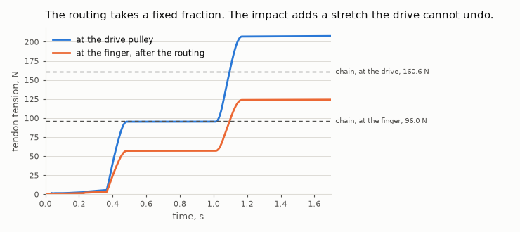
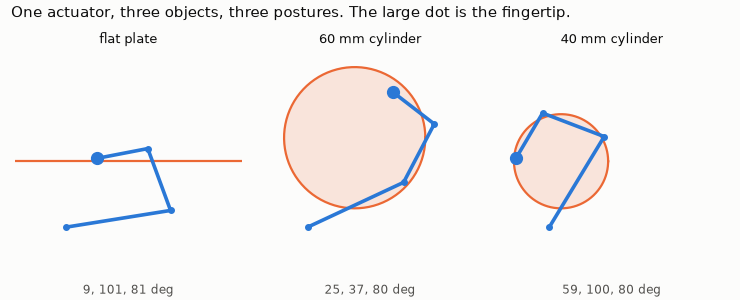

# Transradial Limb Sim

Physics simulation of transradial prosthesis actuation with tendon and motor models.

[](https://github.com/Eelis03/transradial-limb-sim/actions/workflows/ci.yml)
[](https://www.python.org/downloads/)
[](LICENSE)


A tendon driven prosthetic finger is a chain, and this project follows the power along it.
Current goes in at a six cell battery and force comes out at a fingertip, and in between sit
an H bridge, a brushed motor, a three stage planetary gearhead, a drive pulley and a steel
cord routed over four guides. Every link takes a share, and the model computes each share
from published component data rather than from measurement, so a drive train can be judged
before anyone builds it.

Two answers come out of the same chain and they are not the same answer. Of the torque
leaving the motor shaft, 34.86 percent reaches the finger as tendon tension, and that is the
number a hand is sized against. Of the energy leaving the battery, 0.18 percent reaches the
object as work, and that is why a hand which is holding something still gets warm. The figure
above is the second answer.

It is written for someone sizing or reviewing a prosthetic hand drive train who needs to know
whether a chosen motor and gearbox will deliver a usable grasp force, what a grasp costs the
battery, and which link is the one worth improving.

## Results

Every measured number on this page is printed by the script named under its heading. The
rest are configuration constants from `pipeline/scenario.py` or bounds the test suite
asserts, and they are named as such where they appear. Nothing here is quoted from memory.

They all describe one reference configuration: a maxon RE 25 118752 driving a maxon GP 26 B
at 84:1 into an 8 mm drive pulley, a stainless steel tendon of 2.0e4 N/m series stiffness
routed over 3.50 rad of total wrap at a measured friction coefficient of 0.147, an index
finger of 45, 28 and 22 mm phalanges, and a 22.2 V six cell pack. The integration step is
5e-5 s except where stated and the controller runs at 10 kHz.

### Before the first link: does the motor model reproduce its own catalogue?

From `uv run python examples/motor_datasheet_check.py`. The model is built from four
catalogue numbers, the terminal resistance, the inductance, the torque constant and the rotor
inertia, and is then asked for five operating points it was not given.

| Quantity | Model | Catalogue | Error |
| --- | --- | --- | --- |
| No load speed, rpm | 9759 | 9560 | +2.08% |
| No load current, mA | 37.4 | 36.9 | +1.35% |
| Stall torque, mNm | 241.8 | 243 | -0.51% |
| Stall current, A | 10.34 | 10.4 | -0.53% |
| Speed constant, rpm/V | 408.1 | 408 | +0.02% |

The speed constant is the one that matters most, because the catalogue publishes it
independently of the torque constant. Agreement to 0.02 percent says the conversion from
mNm/A and rpm/V into SI is right, which is the error that would otherwise produce a self
consistent but wrong model. The 2.08 percent on no load speed is the catalogue disagreeing
with itself: the speed implied by its own listed torque constant and terminal resistance
differs from its own listed no load speed by that much.

The same script reads out the two gearhead numbers the rest of this page leans on: the
current at its continuous torque rating, 1.121 A, and its average no load backlash of
1.6 degrees at the output, which on the 8 mm drive pulley is 0.223 mm of lost cord travel.

### Link by link, from 1.121 A to 96.0 N

From `uv run python examples/efficiency_chain.py`. This is the quasi static calculation, the
one an engineer does by hand.

Start at the current. It is 1.121 A, and it is not chosen: it is the current at which the
gearhead reaches its catalogue continuous output torque of 1.3 Nm, and it sits below the
motor's own continuous rating of 1.16 A. The gearbox sets the usable current, not the motor.

At the catalogue torque constant of 23.4 mNm/A that current is 26.23 mNm of air gap torque.
The brushes and the bearings take 0.30 mNm of it as Coulomb friction, so 25.93 mNm leaves the
shaft, an efficiency of 0.9885. Nothing worth attacking has happened yet.

The gearhead multiplies torque by 84 and keeps 59 percent of it, giving 1.285 Nm at the
output. That 0.5900 is a catalogue number and not an assumption, and it is the single largest
loss in the chain.

On the 8 mm drive pulley 1.285 Nm is 160.6 N of cord tension. The cord then runs from the
forearm shell over four guides to the fingertip, 3.50 rad of wrap in total. Capstan friction
at the measured coefficient of 0.147 leaves `exp(-0.147 * 3.50) = 0.5978` of the tension, so
96.0 N arrives at the finger.

| Stage | Output | Stage efficiency | What takes the loss |
| --- | --- | --- | --- |
| Battery and bridge | 1.121 A | 1.0000 | current limited by the gearbox torque rating |
| Motor electromagnetic | 26.23 mNm | 1.0000 | torque constant, catalogue |
| Motor brush and bearing friction | 25.93 mNm | 0.9885 | Coulomb share of the no load torque |
| Gearbox, 84:1, three stage | 1.285 Nm | 0.5900 | gear tooth friction, catalogue |
| Drive pulley, 8 mm | 160.6 N | 1.0000 | kinematic, nothing lost here |
| Capstan friction, 3.50 rad of wrap | 96.0 N | 0.5978 | cord sliding on the routing guides |
| Product, motor shaft to finger | | 0.3486 | |

Two thirds of the actuation effort disappears between the motor shaft and the finger, and the
routing takes slightly more of it than the gearbox does. The difference between the two losses
is that the gearbox can be swapped and the routing cannot be out muscled: capstan loss is
multiplicative in the tension, so pulling harder does not recover any of it.

### The same chain counted in joules

From the same script. The energy budget below is measured over a complete 1.7 s grasp of a
rigid 60 mm cylinder, integrating every loss channel alongside the physical states. It is the
figure at the top of this page, in numbers.

| Destination | Energy, J | Share |
| --- | --- | --- |
| Motor copper loss, i squared R | 2.1672 | 54.77% |
| Bridge conduction and quiescent draw | 0.4997 | 12.63% |
| Gearbox tooth friction | 0.4859 | 12.28% |
| Still stored in springs and cord at the end | 0.4019 | 10.16% |
| Capstan friction in the routing | 0.2821 | 7.13% |
| Motor brush and bearing friction | 0.0979 | 2.48% |
| Joint damping | 0.0098 | 0.25% |
| Work delivered to the object | 0.0072 | 0.18% |
| Battery internal resistance | 0.0054 | 0.14% |
| Tendon viscoelastic damping | 0.0003 | 0.01% |
| Joint end stops | 0.0000 | 0.00% |
| Total drawn from the battery | 3.9568 | 100% |
| Balance residual | -6.123e-04 | 0.0155% |

The ranking is not the force ranking. In force the routing and the gearbox are the two big
losses; in energy the winding is, because a stalled grasp draws full current and produces no
mechanical power at all. Over the run the winding turns 2.1672 J into heat and the object
receives 0.0072 J. The place to attack that is a non backdrivable transmission or a
mechanical latch, not a better motor: no change to the gearbox or the routing touches a loss
that exists because the drive is standing still.

The 10.16 percent still stored is elastic energy in the return springs and the stretched cord,
which comes back when the grasp is released rather than being lost.

The last row is the reason to believe the rest. Every power term in the plant is written so
that it is individually signed correctly, which makes

    battery power = sum of loss powers + rate of change of stored energy + power into the object

an identity that holds at every instant, not on average. The accumulators are integrated with
the same scheme as the physical states, so the closure error of the integrated balance is a
measure of integration error and nothing else. It is 0.0155 percent of the energy drawn, and
it falls with the step at the order of the scheme. A loss channel with a wrong sign, a
double counted term or a missing one would show up here as a residual thousands of times
larger.

### What actually arrives, and why it is more than the chain says

From `uv run python examples/fingertip_force_curve.py`.



The figure is the reference grasp, the same run the energy budget above was measured on. The
gap between the two curves is the capstan loss, and it is a fixed ratio rather than a fixed
number of newtons, which is what the exponential law says it should be. The gap between each
curve and its dashed line is something else.

| Current, A | Chain, N | Measured, N | Lossless, N | Grasp force, N | Fingertip force, N |
| --- | --- | --- | --- | --- | --- |
| 0.4484 | 37.74 | 57.20 | 107.00 | 17.25 | 10.41 |
| 0.6726 | 57.17 | 58.31 | 162.08 | 17.59 | 10.62 |
| 0.8968 | 76.59 | 95.88 | 217.17 | 29.36 | 17.73 |
| 1.1210 | 96.02 | 124.12 | 272.25 | 38.29 | 23.09 |

The chain column applies the gearbox and capstan losses in full and the lossless column
removes both, so the two bracket what the drive can possibly produce. The measured tension has
to lie between them, and it does at every current.

It sits above the chain value, and that is physics rather than error. The finger arrives at
the object carrying the kinetic energy of the rotor, the impact stretches the cord, and
neither the cord nor the stuck gearbox can push that stretch back out, because a tendon does
not push and a three stage gearhead at 59 percent efficiency does not back drive. At the
400 rad/s closing speed limit the rotor holds 0.09 J, and a cord that absorbed all of it
would gain 59.9 N of tension. That is the bound the test suite asserts, and the measured
124.12 N against the chain's 96.02 N sits well inside it.

The measured grasp force rises at 31.29 N per ampere, against the 144.96 N per ampere of
tendon tension the transmission puts at the drive pulley. Everything between those two
numbers is the routing loss and the geometry of whatever posture the finger settles into.

### One actuator, three shapes

From `uv run python examples/grasp_adaptivity.py`. The controller is identical in all three
runs and knows nothing about the object.



| Object | Proximal, N | Middle, N | Distal, N | Total, N | Contact points | Settled posture, deg |
| --- | --- | --- | --- | --- | --- | --- |
| Flat plate | 0.00 | 15.80 | 17.13 | 32.93 | 4 | 9.1, 101.1, 80.7 |
| 60 mm cylinder | 12.22 | 6.00 | 20.78 | 39.00 | 7 | 25.0, 37.3, 80.1 |
| 40 mm cylinder | 47.63 | 13.19 | 10.02 | 70.84 | 7 | 58.8, 100.3, 80.4 |

The tendon tension at the finger is 120.4, 122.6 and 120.2 N across the three, a spread of
1.9 percent. One actuator sets one scalar, and it sets nearly the same scalar every time.
What the mechanism varies is how that scalar is shared out: the proximal phalanx carries
nothing at all on the flat plate and 67 percent of the total on the small cylinder.

The postures differ by 38.0 degrees root mean square between the flat plate and the 60 mm
cylinder, 28.7 between the flat plate and the 40 mm cylinder, and 41.3 between the two
cylinders. A finger with a fixed ratio between its joints, which is how underactuated hands
are often modelled, would draw the same outline three times and return three identical rows.
Nothing in the code chooses this behaviour: it is what the force balance between the tendon,
the return springs and the contact produces.

### How fast it closes, and what a loop can do with it

From `uv run python examples/finger_closing.py` and
`uv run python examples/force_control.py`.

| Metric | Value |
| --- | --- |
| Closing time to 95 percent of travel, current limited | 0.360 s |
| Peak motor speed while closing | 8817 rpm |
| Motor no load speed at 22.2 V | 9026 rpm |
| Peak tendon speed | 87.9 mm/s |
| Peak fingertip speed | 765 mm/s |
| Battery energy for one free closure | 4.150 J |
| Stall tendon tension at the drive | 207.6 N |
| Stall tendon tension at the finger | 124.1 N |
| Stall grasp force, summed over the finger | 38.3 N |
| Stall fingertip force, distal phalanx | 23.1 N |

Free closing is speed limited rather than force limited: the finger reaches 8817 rpm against
a no load speed of 9026 rpm at this supply, so the drive spends the closure near its back
electromotive force limit and not near its torque limit. That is why the closing time barely
moves when the transmission parameters do, which the sweep below shows.

The grasp runs above do not close this fast, and deliberately so. They hold the drive to a
400 rad/s closing speed limit and only raise the current to squeeze after one second, because
a finger that arrives at full speed carries enough rotor kinetic energy to set the grasp
force by impact rather than by command.

The armature corner frequency is 1551 Hz, the current loop is placed at 500 Hz by pole
assignment on the armature, and the controller samples at 10 kHz. Everything an outer loop
can do has to fit inside that.

| Loop | Target | Settled | Error | Overshoot | Time to 90 percent |
| --- | --- | --- | --- | --- | --- |
| Motor position | 250.0 rad | 252.24 rad | +0.90% | 32.4% | 0.307 s |
| Fingertip force | 4.0 N | 3.24 N | -0.76 N | to 8.06 N peak | 0.629 s |
| Fingertip force | 8.0 N | 9.40 N | +1.40 N | to 9.75 N peak | 0.488 s |
| Fingertip force | 12.0 N | 11.87 N | -0.13 N | to 12.35 N peak | 0.575 s |

The force loop runs an integral gain of 0.05 A per newton second, three orders of magnitude
below what a rigid actuator would allow. Two things bound it: the current loop underneath,
and the series compliance of the tendon, which puts a lightly damped mode between the motor
and the fingertip. The rise times contain the approach as well, because no force exists at
all until the finger arrives.

The 0.76 N shortfall at the 4 N set point is the largest error of the three and it belongs to
the smallest set point, which is what a fixed dead zone does. The model carries the 0.223 mm
of gearhead play listed above, and a loop has to wind that out of the transmission before it
can trim anything, so the same absolute penalty costs a larger fraction of a smaller command.

### What the runs ask of the parts, against what the parts are rated for

From `uv run python examples/rating_audit.py`. The drive is sized by the force balance two
sections up: the current limit is the current at which the gearhead reaches its continuous
output torque, and it sits below the motor's own continuous current. That is a statement
about a chain with no speed in it and no impact, and both reference runs break it.

| Run | Rating | Published | Peak | Margin | Time above |
| --- | --- | --- | --- | --- | --- |
| Free closing, 0.80 s | motor continuous current | 1.16 A | 1.131 A | 0.975 | 0.000 s |
| | gearbox continuous output torque | 1.3 Nm | 2.2155 Nm | 1.704 | 0.368 s |
| | gearbox intermittent output torque | 1.9 Nm | 2.2155 Nm | 1.166 | 0.335 s |
| | gearbox input speed | 8000 rpm | 8817 rpm | 1.102 | 0.368 s |
| Rigid grasp, 1.70 s | motor continuous current | 1.16 A | 1.123 A | 0.968 | 0.000 s |
| | gearbox continuous output torque | 1.3 Nm | 1.6610 Nm | 1.278 | 0.603 s |
| | gearbox intermittent output torque | 1.9 Nm | 1.6610 Nm | 0.874 | 0.000 s |
| | gearbox input speed | 8000 rpm | 3747 rpm | 0.468 | 0.000 s |

The speeds are given here in rpm, which is the unit the catalogue quotes them in; the audit
works in rad/s and the script prints both. Each time above is the time the run spent past the
rating, with every crossing placed between the two samples that bracket it rather than being
counted in whole samples.

The motor stays inside its own rating in both runs, which is the sizing calculation working
as intended. Everything that does not is the gearhead.

The grasp holds 1.6610 Nm at the gearbox output for 0.603 s, against the 1.3 Nm the current
limit was derived from. That is the excess the settled tendon tension already shows over the
chain, read at the other end of the drive pulley and measured against a rating instead of
against a prediction, and it has the same cause: the impact stretch cannot be pushed back
out. It stays below the 1.9 Nm the catalogue permits intermittently, so the reference grasp
is a hard duty and not an overload.

Free closing is the worse case and it is the one that looks harmless. With nothing to grasp,
the finger runs into its own end stops still turning near the 8817 rpm peak, the cord absorbs
the arrival, and the drive settles holding 2.2155 Nm at the gearbox output: 1.70 times the
continuous rating, and 1.17 times the torque the catalogue permits even intermittently, for
0.335 s of a 0.80 s run. The same run holds the gearhead input above its recommended
8000 rpm for 0.368 s.

That is not a modelling artefact and it is not new physics either. It is the same impact this
page has already described twice, arriving at the speed the grasp runs deliberately avoid:
they hold the drive to a 400 rad/s closing speed limit so that the finger does not reach the
object carrying the whole kinetic energy of the rotor, and the free closing measurement, by
design, does not. What the audit adds is that the run nobody would have thought to check is
the one the gearhead cannot be asked to repeat.

### The two numbers nobody has measured

From `uv run python examples/sensitivity_study.py`. The tendon series stiffness and the
capstan friction coefficient of a hand that does not yet exist are not known, so every number
above is only as firm as the range those two are allowed to take.

Tendon series stiffness, swept over a factor of forty:

| Stiffness, N/m | Closing time, s | Grasp force, N | Fingertip force, N | Tendon tension, N | Capstan loss, J |
| --- | --- | --- | --- | --- | --- |
| 5 000 | 0.370 | 33.73 | 20.35 | 109.72 | 0.8309 |
| 10 000 | 0.364 | 35.62 | 21.49 | 115.68 | 0.4718 |
| 20 000 | 0.360 | 38.29 | 23.09 | 124.12 | 0.2821 |
| 50 000 | 0.360 | 37.07 | 22.36 | 120.28 | 0.1216 |
| 200 000 | 0.360 | 32.25 | 19.47 | 105.05 | 0.0458 |

Capstan friction coefficient:

| Coefficient | Closing time, s | Grasp force, N | Fingertip force, N | Tendon tension, N | Transmission ratio |
| --- | --- | --- | --- | --- | --- |
| 0.000 | 0.362 | 61.52 | 36.95 | 196.72 | 1.000 |
| 0.050 | 0.362 | 52.30 | 31.46 | 168.04 | 0.839 |
| 0.100 | 0.362 | 44.49 | 26.80 | 143.61 | 0.705 |
| 0.147 | 0.360 | 38.29 | 23.09 | 124.12 | 0.598 |
| 0.200 | 0.360 | 32.41 | 19.56 | 105.55 | 0.497 |

Closing time is insensitive to both, moving 2.8 percent across a fortyfold change of
stiffness and 0.6 percent across the friction sweep, for the reason given above: free closing
is speed limited. Grasp force is insensitive to stiffness, moving 17.1 percent with no
monotone trend, and strongly sensitive to friction, moving 63.6 percent. At the reference
coefficient the routing alone removes 36.9 percent of the tendon tension that would otherwise
reach the finger.

That is the engineering conclusion of the whole page. The routing is the first thing to
improve. Taking the friction coefficient from 0.147 to 0.05, which is what a low friction
liner or rolling element idlers would give, raises the grasp force from 38.3 N to 52.3 N at
the same current, in the same package, on the same motor. No change of motor at that size
would match it.

## Installation

Requires Python 3.12 or later. Continuous integration runs the whole suite on 3.12 and 3.13,
on Linux and on Windows, so the version floor in `pyproject.toml` is a tested claim rather
than a declared one.

```bash
git clone https://github.com/Eelis03/transradial-limb-sim.git
cd transradial-limb-sim
uv sync
```

Using pip instead of uv:

```bash
python -m venv .venv
source .venv/bin/activate     # Windows: .venv\Scripts\activate
pip install -e ".[dev]"
```

## Running it

The library is a set of pure functions over parameter dataclasses. The quasi static chain
takes one line:

```python
from transradial_sim.analysis.energetics import force_chain
from transradial_sim.pipeline.scenario import build_plant

plant = build_plant()
chain = force_chain(plant)

for stage in chain.stages:
    print(f"{stage.name:<34}{stage.value:>10.4g} {stage.unit:<3}{stage.efficiency:>8.4f}")
print(f"tendon tension at the finger: {chain.finger_tension_n:.1f} N")
```

```text
battery and bridge                     1.121 A   1.0000
motor electromagnetic                0.02623 Nm  1.0000
motor brush and bearing friction     0.02593 Nm  0.9885
gearbox                                1.285 Nm  0.5900
drive pulley                           160.6 N   1.0000
capstan friction in the routing        96.02 N   0.5978
tendon tension at the finger: 96.0 N
```

Each script in `examples/` produces one section of the results above:

```bash
uv run python examples/motor_datasheet_check.py
uv run python examples/efficiency_chain.py
uv run python examples/fingertip_force_curve.py
uv run python examples/grasp_adaptivity.py
uv run python examples/finger_closing.py
uv run python examples/force_control.py
uv run python examples/rating_audit.py
uv run python examples/sensitivity_study.py
```

Every one of them accepts `--quick`, which shortens the runs for smoke testing, and
`--no-figures`, which suppresses figure output. Their scratch figures go to `outputs/`,
which is not tracked.

The three figures on this page are tracked, in `docs/figures/`, and one command rebuilds
all three:

```bash
uv run python examples/publish_figures.py
```

They are snapshots, refreshed deliberately when a result moves. The continuous integration
workflow does not compare them byte for byte, because matplotlib output is not byte
reproducible across platforms or releases, and a check that failed on a font hinting
difference would train everyone to ignore it. What the workflow does check is that the
figure builders still assemble each figure from the data they are handed, which is what
`tests/test_figures.py` asserts.

## How it is built

The plant is one coupled electromechanical system integrated as a whole: armature current,
motor shaft angle and speed, three joint angles and their rates, and twelve energy
accumulators, advanced by a fixed step fourth order Runge-Kutta scheme under a zero order
hold controller. The choices behind that, and the alternatives rejected on the way, including
an adaptive stiff solver, kinematic coupling between the joints and a bristle friction model,
are in [docs/design-notes.md](docs/design-notes.md) together with what each would have cost
and bought.

That file also lists what the model does not do, and one entry that used to be on the list
and is not any more. The gearhead has 1.6 degrees of published backlash and the model had
none; it now carries it as a dead band on the tendon, which cost one parameter, one argument
and eight tests, and which moved exactly the numbers the old entry predicted it would move.

| Module | Responsibility |
| --- | --- |
| `model/units.py` | SI conversions from catalogue units and the regularised sign function |
| `model/motor.py` | Brushed motor electrical and mechanical dynamics, catalogue parameters, predicted operating points |
| `model/gearbox.py` | Reduction, reflected inertia, load dependent friction with a stick band, output backlash |
| `model/tendon.py` | Series compliance, one way tension clamp, capstan friction, gearhead lost motion |
| `model/finger.py` | Planar chain kinematics, mass matrix, recursive Newton-Euler, return springs, end stops |
| `model/contact.py` | Object shapes and the Hunt and Crossley contact law |
| `model/system.py` | The assembled plant, the state layout and the exact energy accounting |
| `algorithm/protocols.py` | Structural interfaces for controllers and integrators |
| `algorithm/integrators.py` | Fixed step Runge-Kutta and Euler schemes, Richardson order estimation |
| `algorithm/controllers.py` | Current, position and force loops with anti windup, slew and speed limiting |
| `pipeline/trace.py` | The structured record a run produces |
| `pipeline/simulate.py` | The two rate simulation driver |
| `pipeline/scenario.py` | The reference prosthesis, the test objects and the standard scenarios |
| `analysis/energetics.py` | Quasi static force chain and the measured loss budget |
| `analysis/metrics.py` | Closing time, settled grasp summary, headline performance figures |
| `analysis/ratings.py` | Peak, margin and time above each published component rating |
| `analysis/sensitivity.py` | Sweeps over tendon stiffness and capstan friction |
| `analysis/figures.py` | Figure builders, the only module that imports matplotlib |
| `examples/` | Thin wiring scripts, no logic of their own |

Each layer imports only from the ones above it. The model layer performs no input or output
and holds no mutable state, the algorithm layer does no plotting, and the analysis layer
reads a trace and nothing else. The package ships `py.typed`, so an installed copy delivers
its annotations rather than only passing `mypy` in this repository.

### Checks

```bash
uv run pytest
uv run ruff check .
uv run ruff format --check .
uv run mypy
uv run pytest --cov=src/transradial_sim --cov-report=term-missing
```

The suite is 137 tests in three tiers: property and invariant tests covering the mathematics,
regression tests pinning recorded behaviour, and integration tests running every example
script under a reduced step count.

The last command above measures statement coverage, and it is 99.44 percent. The workflow
runs the same command with `--cov-fail-under=97`, which is that figure rounded down with two
points of headroom for a platform difference. What is not covered is the body of the two
sensitivity sweeps, which run ten full simulations each and are exercised end to end by the
integration tier instead, and two defensive branches that no reachable input reaches.

The invariant tier holds the checks that would fail loudest if the physics were wrong: the
motor reproduces five catalogue operating points, the torque and back electromotive force
constants agree with the independently published speed constant, energy is conserved to
4.7e-8 relative over 40 ms with every loss coefficient set to zero, the balance closes to
2.6e-9 relative over 250 ms with every loss enabled and to 1.5e-4 over the full grasp
reported above, the tendon holds zero tension against an adversarial command to compress the
cord by a metre at a metre per second, the capstan relation reproduces `exp(-mu theta)` at a
known wrap angle, the closed form mass matrix agrees with the recursive Newton-Euler
algorithm to 1e-12, the finger settles into measurably different postures on a flat and a
round object, and the drive current never exceeds its limit under a full duty open loop
command.

Every tolerance is derived from a measurement scale rather than from an observed error. The
two scales that appear are the integration step together with the order of the scheme, and
the sample interval of a recorded trace. Each test states which one it uses, and the policy
is recorded in [docs/design-notes.md](docs/design-notes.md).

The suite runs in about 100 seconds, or about 200 with coverage instrumentation.

## References

### Component data

- maxon motor ag. *RE 25, 25 mm, Graphite Brushes, 20 Watt*, order number 118752, catalogue
  page, May 2017 edition. Terminal resistance 2.32 ohm, terminal inductance 0.238 mH, torque
  constant 23.4 mNm/A, speed constant 408 rpm/V, rotor inertia 10.8 g cm squared, no load
  speed 9560 rpm, no load current 36.9 mA, stall torque 243 mNm, stall current 10.4 A,
  maximum continuous current 1.16 A.
  <https://www.maxongroup.com/maxon/view/product/motor/dcmotor/re/re25/118752>
- maxon motor ag. *Planetary Gearhead GP 26 B, 26 mm, 0.5 to 2.0 Nm*, order number 144039,
  catalogue page, May 2008 edition. Reduction 84:1, three stages, maximum efficiency
  59 percent, maximum continuous output torque 1.3 Nm, intermittently permissible 1.9 Nm,
  mass inertia 0.4 g cm squared referred to the motor shaft, average no load backlash
  1.6 degrees, recommended maximum input speed 8000 rpm.
  <https://www.maxongroup.com/maxon/view/product/gear/planetary/GP-Sonderprogramm/144039>

### Capstan friction

- Lubarda, V. A. "The Mechanics of Belt Friction Revisited." *International Journal of
  Mechanical Engineering Education*, volume 42, number 2, pages 97 to 112, 2014.
  DOI: 10.7227/IJMEE.0002. Rigorous derivation of the capstan relation, the conditions under
  which the exponential form holds, and the historical attribution.
- Euler, L. "Remarques sur l'effet du frottement dans l'equilibre." *Memoires de l'academie
  des sciences de Berlin*, volume 18, volume year 1762, printed 1769, pages 265 to 278.
  Eneström index E382. The original statement of the belt friction law.
  <https://scholarlycommons.pacific.edu/euler-works/382/>
- Jung, J. H., Pan, N., and Kang, T. J. "Capstan equation including bending rigidity and
  non-linear frictional behavior." *Mechanism and Machine Theory*, volume 43, number 6, pages
  661 to 675, 2008. DOI: 10.1016/j.mechmachtheory.2007.06.002. The corrections to the
  exponential law that a stiff cord introduces, which this model omits.
- Stuart, I. M. "Capstan equation for strings with rigidity." *British Journal of Applied
  Physics*, volume 12, number 10, pages 559 to 562, 1961. DOI: 10.1088/0508-3443/12/10/309.

### Measured tendon transmission

- Agrawal, V., Peine, W. J., and Yao, B. "Modeling of Transmission Characteristics Across a
  Cable-Conduit System." *IEEE Transactions on Robotics*, volume 26, number 5, pages 914 to
  924, 2010. DOI: 10.1109/TRO.2010.2064014. Source of the friction coefficient of 0.147 used
  here, measured on a 0.52 mm uncoated stainless steel 7 by 19 rope in a 1.2 mm inner
  diameter stainless conduit over 12 mm pulleys, at pretensions from 0.7 N to 7.3 N. A model
  fit to the same data back calculates 0.156. The reference tendon in this project is
  specified as the same construction so that the measurement applies to it directly.
- Nahvi, A., Hollerbach, J. M., Xu, Y., and Hunter, I. W. "An investigation of the
  transmission system of a tendon driven robot hand." *Proceedings of the 1994 IEEE/RSJ
  International Conference on Intelligent Robots and Systems*, volume 1, pages 202 to 208,
  1994. DOI: 10.1109/IROS.1994.407390. Reports 0.13 over routing pulleys. Measured on 12.4 mm
  pulleys with a 3 mm bore, so it is an effective coefficient dominated by the bearing rather
  than by sliding of the cord.
- Li, Z., Chen, X., Ringwald, J., Pozo Fortunic, E., Ganguly, A., and Haddadin, S.
  "Investigation of the tendon-driven transmission for anthropomorphic robotic hands."
  *Proceedings of the 2024 IEEE/RSJ International Conference on Intelligent Robots and
  Systems*, pages 8330 to 8337, 2024. DOI: 10.1109/IROS58592.2024.10801538. Measured force
  transmission efficiency of 60 percent at 10 N, which corroborates the 0.598 ratio this
  model computes for its routing.
- Grosu, V., Grosu, S., Vanderborght, B., Lefeber, D., and Rodriguez-Guerrero, C. "Design of
  Smart Modular Variable Stiffness Actuators for Robotic-Assistive Devices." *Frontiers in
  Robotics and AI*, volume 5, article 105, 2018. DOI: 10.3389/frobt.2018.00105. Cable
  transmission efficiency of 64 to 76 percent.
- Friedl, W., Chalon, M., Reinecke, J., and Grebenstein, M. "FRCEF: The new friction reduced
  and coupling enhanced finger for the Awiwi hand." *Proceedings of the 2015 IEEE-RAS
  International Conference on Humanoid Robots*, pages 140 to 147, 2015.
  DOI: 10.1109/HUMANOIDS.2015.7363527. Reports polymer tendon losses as a percentage per
  routing element rather than as a friction coefficient, about 1.1 percent for steel and 2.5
  to 4.75 percent for Dyneema, reaching 30 percent across seven pulleys. Cited here because
  no peer reviewed source reports a directly measured friction coefficient for ultra high
  molecular weight polyethylene cord on steel or aluminium, which is why the reference tendon
  in this project is a steel rope rather than a polymer cord.
- Palli, G., and Melchiorri, C. "Model and control of tendon-sheath transmission systems."
  *Proceedings of the 2006 IEEE International Conference on Robotics and Automation*, pages
  988 to 993, 2006. DOI: 10.1109/ROBOT.2006.1641838. The tendon and sheath alternative
  rejected in the design notes.
- Kaneko, M., Yamashita, T., and Tanie, K. "Basic considerations on transmission
  characteristics for tendon drive robots." *Proceedings of the Fifth International
  Conference on Advanced Robotics*, pages 827 to 832, 1991. DOI: 10.1109/ICAR.1991.240572.

### Underactuated hands

- Birglen, L., Laliberte, T., and Gosselin, C. *Underactuated Robotic Hands*. Springer Tracts
  in Advanced Robotics, volume 40, Springer, 2008. DOI: 10.1007/978-3-540-77459-4. The force
  balance formulation of underactuated fingers that the finger model follows. The series
  volume number comes from the Springer series listing rather than from the Crossref record.
- Laliberte, T., and Gosselin, C. "Simulation and design of underactuated mechanical hands."
  *Mechanism and Machine Theory*, volume 33, number 1 to 2, pages 39 to 57, 1998.
  DOI: 10.1016/S0094-114X(97)00020-7. Shape adaptation as a consequence of the force balance
  rather than of a commanded trajectory.
- Dollar, A. M., and Howe, R. D. "The Highly Adaptive SDM Hand: Design and Performance
  Evaluation." *The International Journal of Robotics Research*, volume 29, number 5, pages
  585 to 597, 2010. DOI: 10.1177/0278364909360852. Measured conformance of an underactuated
  hand across object shapes, the behaviour reproduced in the adaptivity example.
- Belter, J. T., Segil, J. L., Dollar, A. M., and Weir, R. F. "Mechanical design and
  performance specifications of anthropomorphic prosthetic hands: A review." *Journal of
  Rehabilitation Research and Development*, volume 50, number 5, pages 599 to 618, 2013.
  DOI: 10.1682/JRRD.2011.10.0188. Note that its Table 2 tabulates fingertip speeds and not
  closing times for the commercial hands, so any closing time attributed to those hands in
  this project is derived from their tabulated speed and is labelled as derived.

### Numerical methods

- Hunt, K. H., and Crossley, F. R. E. "Coefficient of Restitution Interpreted as Damping in
  Vibroimpact." *Journal of Applied Mechanics*, volume 42, number 2, pages 440 to 445, 1975.
  DOI: 10.1115/1.3423596. The contact law used in `model/contact.py`.
- Karnopp, D. "Computer Simulation of Stick-Slip Friction in Mechanical Dynamic Systems."
  *Journal of Dynamic Systems, Measurement, and Control*, volume 107, number 1, pages 100 to
  103, 1985. DOI: 10.1115/1.3140698. The stick band formulation used for the gearbox and the
  routing friction.
- Featherstone, R. *Rigid Body Dynamics Algorithms*. Springer US, 2008.
  DOI: 10.1007/978-1-4899-7560-7, print ISBN 978-0-387-74314-1. The recursive Newton-Euler
  algorithm and the composite rigid body method used to form the mass matrix. The DOI
  10.1007/978-0-387-74315-8, which circulates widely for this title, resolves to a different
  book by the same author, *Robot Dynamics Algorithms*, 1987.
- Hairer, E., Norsett, S. P., and Wanner, G. *Solving Ordinary Differential Equations I:
  Nonstiff Problems*, second revised edition. Springer Series in Computational Mathematics,
  volume 8, Springer, 1993. DOI: 10.1007/978-3-540-78862-1. Order conditions and the
  stability region of the classical fourth order Runge-Kutta scheme, and Richardson
  extrapolation for the observed order.
- Dormand, J. R., and Prince, P. J. "A family of embedded Runge-Kutta formulae." *Journal of
  Computational and Applied Mathematics*, volume 6, number 1, pages 19 to 26, 1980.
  DOI: 10.1016/0771-050X(80)90013-3.

### Dependencies

| Package | Purpose | Licence |
| --- | --- | --- |
| numpy | Array storage for simulation traces and the analysis layer | BSD 3-Clause |
| scipy | Available for numerical utilities in the analysis layer | BSD 3-Clause |
| matplotlib | Figure generation in `analysis/figures.py` | Matplotlib licence, PSF based |
| pytest | Test runner for all three tiers | MIT |
| pytest-cov | Statement coverage measurement and the floor enforced in the workflow | MIT |
| ruff | Linting and import ordering | MIT |
| mypy | Static type checking under strict mode | MIT |

## License

Released under the MIT license. See [LICENSE](LICENSE).
